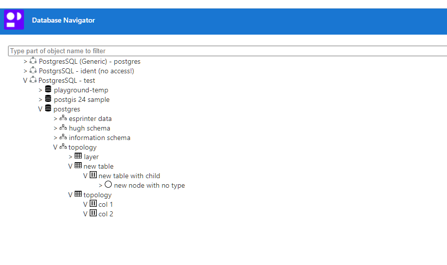

# DbTree

Dynamic database navigator 

## Development server

Run `ng serve` for a dev server. Navigate to `http://localhost:4200/`. The app will automatically reload if you change any of the source files.
Run `ng test` to execute the unit tests via [Karma](https://karma-runner.github.io).
